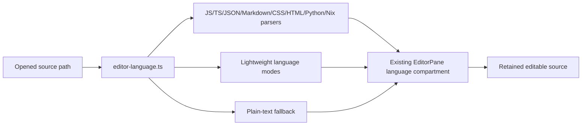

# Source language selection

Source colors are a small part of the [cockpit](cockpit.md), not another source
of repository truth. The existing file broker supplies bytes; the opened path
selects a stable parser extension. The existing editor retains ownership of
selection, dirty content, undo state, save callbacks and focus.

`sourceLanguageName(path)` recognizes only the basename; `sourceLanguage(path)`
returns the same extension object for repeated requests. Stream modes have
autocomplete data removed before they are constructed. The code does not add
keyboard handlers, open files, load external configuration, start processes or
fetch language information. Path navigation is a separate cockpit concern.

Starlark uses Python's shared lexical syntax; Move uses approximate Rust-like
coloring. Neither is a dedicated grammar. All recognition rules and practical
limits are listed in [Source language colors](../editor-languages.md). Unknown
files remain plain text. This component makes no syntax-validity claims.

## Build connections

| Input / target | Connection |
| --- | --- |
| `app/renderer/editor-language.ts` | Renderer input to root `//:quality_sources`, consumed by `//:desktop-bundle` |
| `package.json`, `pnpm-lock.yaml`, `pnpm-workspace.yaml` | Pinned parser dependencies and one compatible CodeMirror state implementation; root `//:quality_sources` inputs |
| `tests/editor-project-languages.test.ts`, `tests/editor-syntax.test.tsx`, `tests/editor-syntax-dependencies.test.mjs` | Root test inputs, exercised by `//tools/demo-syntax:editor-tests` |
| `//tools/demo-syntax:editor-tests` | Existing syntax target, also runs TypeScript boundaries and actual cursor/source-handoff regressions |
| `//tools/demo-syntax:smoke` | Depends on `//:desktop-bundle`, syntax proof sources and owned virtual-desktop driver |

Keep this map and the coverage table aligned with parser imports, detection
rules and proof samples when changing language support. No independently deployed
service or source-derived language discovery graph exists here.
